# SIE Field Intelligence Context — Architecture v0.1

**SIE Milestone M31 — Field Intelligence Context Foundation v0.1.**
Architecture-first, documentation-only. This document defines the
minimum formal architecture SIE needs to construct a **Field
Intelligence Context** — SIE's current, evidence-grounded, point-in-time
understanding of the safety situation for a defined organizational
scope — from capabilities that already exist in the repository. It
inspects the actual code at commit `f8dddaa17f460c6c231b91e8b4ea4df781fb4fa8`
(the frozen M30 baseline), not prior completion reports. It changes no
production behavior: no migration, no model, no endpoint, no route, no
service, no frontend, no AI integration.

This document builds directly on
`backend/docs/SIE_OPERATIONAL_INTELLIGENCE_LOOP_V0_1.md` (M30) and does
not re-derive what that document already established — it is cited
throughout rather than repeated. Where this investigation found new
detail M30 did not cover (the document/knowledge-ingestion adapter
system as a distinct concept from safety-event-ingestion adapters; the
exact `Prediction`/`PredictiveContext` schema; the precise, narrow scope
of the predictive-risk consumption gap), it is reported here in full,
since M31's own subject — composing existing intelligence into one
context — depends on getting those details exactly right.

---

## 1. Purpose

Answer, architecturally, one question: **what does SIE need to be able
to say, defensibly, when asked "what do you understand about this site
right now"** — and how should that answer be assembled from capabilities
that already exist, without inventing a second operational system, a
new persisted "state" table, or any new statistical/AI capability.

The output of this milestone is a contract and a composition model, not
a running service. No `GET /field-intelligence-context` endpoint is
built in M31; this document specifies what such an endpoint would need
to compose from, and why, so that a future implementation milestone
(§18) has an unambiguous architecture to build against.

## 2. Product Boundary

> SIE should understand the field, not manage the field.
>
> SIE should inform operational HSE systems and decision-makers, not
> replace them.

This is not new guidance for the codebase — `docs/INTEGRATION_GUIDE.md`
already states it independently, for external integrators: SIE "never
automatically suspends or disciplines a worker, blocks a permit, shuts
down equipment, contacts a regulator, closes an incident, modifies your
organization's own records... Every response is advisory information
for a human decision-maker." M30 §2 confirmed this boundary is enforced
in code, not merely documented, everywhere it was checked (risk
assessment approval, finding closure, control-effectiveness assessment,
predictive-model promotion). This milestone's job is to make sure the
Field Intelligence Context — the single most "central" artifact SIE
will ever produce — is designed from the start so that composing it
can never accidentally cross this boundary.

SIE may provide lightweight input/output extensions (§4, Mode B) where
an organization lacks mature HSE technology. Those extensions are
capture/adapter mechanisms, never a second, competing operational
system. Concretely: SIE already has a document-ingestion pipeline
capable of accepting a spreadsheet upload (§8) — accepting the file is
a legitimate lightweight extension; building incident-tracking
workflow, assignment, and status management around it would not be.

**Diagram A — SIE position in enterprise architecture.**

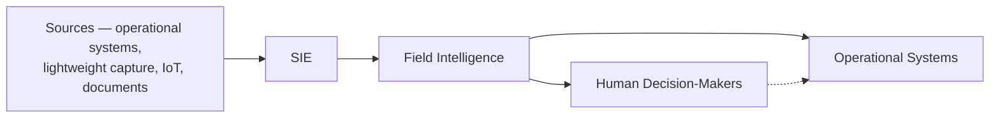

## 3. SIE vs HSE Management Systems

Confirmed against the repository, not merely asserted: nothing in the
codebase today implements incident-management workflow, inspection
scheduling, permit-to-work issuance, contractor qualification tracking,
training-record management, document-control workflow, full
corrective-action lifecycle beyond what §3.7/§3.8 of M30 already
describe (a single-organization action's own OPEN→...→terminal state
machine, not a multi-party corrective-action *process*), audit-program
management, CMMS, ERP, or workforce management. `SafetyAction` (M30
§3.8) is the one domain that comes closest to an operational workflow
concern, and M30 already flagged (§5, Open Question 1) that this is
worth an explicit product decision rather than an assumption. M31 does
not resolve that question; it reinforces the constraint that the Field
Intelligence Context itself must never expand SIE's ownership footprint
to compensate for the systems listed above being absent — a missing
permit system, for example, means Field State (§6) simply cannot yet
answer "are there active permits here," not an invitation for SIE to
start issuing permits.

## 4. Two Deployment Modes

Both modes are real architectural shapes this system must support, not
a hypothetical choice. The repository already contains asymmetric
support for each, described precisely rather than optimistically.

**Mode A — Intelligence Layer** (organizations with existing systems).
Fully supported today via the machine-client (`ApiClient`) architecture
(M30 §3.11): any external HSE platform, ERP, HR/training system, CMMS,
permit system, or IoT/telemetry source can push structured events via
`POST /api/v1/data/ingestion` or the legacy `/intelligence/events*`
routes, and pull intelligence/predictions/RAG answers back out, all
through the same versioned `/api/v1` surface — `INTEGRATION_GUIDE.md`
is explicit that "any authorized application integrates the exact same
way" as the reference Safelytic/ThirdPartyHSE examples.

**Mode B — Intelligence + Lightweight Extensions** (organizations without
mature systems). Partially supported, and the exact boundary is
important to state precisely (§8, §17): a document/spreadsheet **can**
already be uploaded and made searchable (feeding the RAG/knowledge
corpus) via the existing document-ingestion pipeline (`app/ingestion/`
+ `CSVAdapter`/`XLSXAdapter`/... — M30 §3.1's "Pipeline A"). What does
**not** yet exist is a general, registered adapter that turns an
uploaded CSV/XLSX of safety records into structured `SafetyEvent` rows
for an arbitrary organization — the one place that mapping has been
built (`backend/app/services/real_dataset_loader.py`) is a one-off
evaluation script for a specific historical milestone's own dataset
validation, not a production, API-reachable capture path. This is the
central, honestly-stated gap Mode B has today (§17, Gap FG1) — the
architecture for it (§8) is defined here; the adapter itself is not
built in M31, per this milestone's own instruction not to implement
every adapter.

**Diagram B — Two deployment modes.**

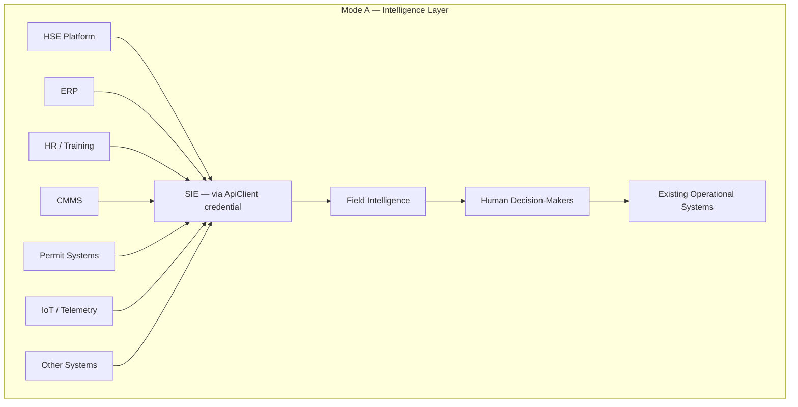

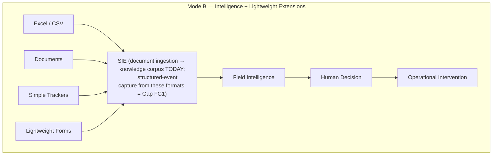

## 5. Field Intelligence Context Definition

A Field Intelligence Context is SIE's derived, point-in-time,
evidence-grounded understanding of the safety situation for a defined
organizational scope, assembled entirely from data and intelligence
SIE already governs. Restating the eight required properties, each
checked against an existing precedent rather than asserted new:

| Property | Existing precedent |
|---|---|
| Derived | `compute_enterprise_intelligence()` and `app/risk_assessment/reporting.py` both compute rich summaries live, on every read, with no snapshot table (M30 §3.5, §6) |
| Site/organizationally scoped | Every intelligence surface already takes `organization_id` (+ optional `site_id`) as a mandatory, authorized parameter |
| Point-in-time aware | `events_as_of()`'s dual `event_time`/`ingestion_time` guard (M30 §3.4) |
| Provenance-aware | `calculation_versions`, `evidence_reference`, `Citation` chains (M30 §14) |
| Composed from existing SIE intelligence | This is the explicit design constraint this document enforces (§7) |
| Source-independent | The `DataSource`/`ApiClient` abstraction already treats every source uniformly regardless of maturity (§8) |
| Explainable | `explanations.py`'s evidence-linked templates; RAG's citation chain |
| Non-authoritative w.r.t. source systems | No mutation path in any intelligence read surface; `require_editable()`/dedicated-endpoint governance protects the one place SIE *is* authoritative (Risk Assessment) from being confused with the read-only context around it |

It is **not** a second operational system of record. Concretely: a
Field Intelligence Context may say "3 open findings, 1 overdue action,
anomalous near-miss count" — it may never become the place a user marks
an action complete or closes a finding. Those mutations remain exactly
where M30 already placed them (the Risk Assessment/Actions domains,
behind their own dedicated, governed endpoints); the context only
*reads* their current state.

## 6. Context Scope

A Field Intelligence Context is always addressed by:

- `organization_id` (required, authorized) — the same tenant-isolation
  guarantee every existing intelligence surface already enforces (M30
  §3.11).
- `site_id` (optional) — organization-wide or one site, mirroring
  `RiskAssessmentScope`'s existing `ORGANIZATION`/`SITE` distinction and
  `compute_enterprise_intelligence()`'s own existing
  `scope`/`entity_id` parameters.
- `as_of` (optional, defaults to now) — the point in time the context
  answers "what did SIE know" for (§10).
- `window_days` (optional, defaults to the existing
  `RISK_ASSESSMENT_DEFAULT_WINDOW_DAYS`/`ENTERPRISE_INTELLIGENCE_ALLOWED_WINDOW_DAYS`
  configuration already governing every other windowed computation) —
  never a bespoke new window concept.

No new scope dimension is introduced. `LOCATION`-scope (already present
as a forward-compatible, currently-`SITE`-equivalent value on
`RiskAssessmentScope`, per M25's own documented rationale) and any
future work-activity/permit/equipment scope (M30 §16, Gap G5) are
explicitly out of scope for M31's own context contract — the contract
below is written to be extensible to a narrower sub-site scope later
without a breaking change, but does not attempt to define one now.

## 7. Context Composition

The context is a strict, labeled composition of four categories —
never merged into one undifferentiated feed, and never allowed to
imply a stronger relationship between categories than the evidence
supports.

**Diagram C — Field Intelligence Context.**

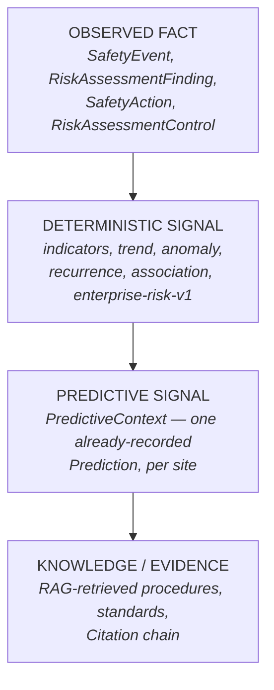

Each category maps onto an existing backend surface, listed with the
exact function/model this document commits to reusing:

**Observed** — `SafetyEvent` rows (via `events_as_of()`), open
`RiskAssessmentFinding`s and their `RiskControl`s, open `SafetyAction`s
— all already-persisted, already-governed facts. No new observation
type is introduced.

**Deterministic intelligence** — the output of
`compute_enterprise_intelligence()` verbatim: indicators, trend,
concentration, recurrence, anomaly, association, `deterministic_risk`
(`enterprise-risk-v1`). This category is always statistical, never
causal, and always carries `calculation_versions` (M30 §3.5).

**Predictive intelligence** — `PredictiveContext`, **already computed
by the existing orchestrator** (a finding this investigation confirmed
precisely, correcting the imprecision in M30's own gap analysis — see
§13). Never a new prediction generated on demand; always the latest
already-recorded, already-governed `Prediction` row for the requested
site.

**Knowledge/evidence** — RAG/retrieval results, scoped by the context's
own `organization_id` and, where the ontology's risk-area/topic
vocabulary allows it (M30 §16, Gap G2), by relevant governed
concept — reusing `RetrievalService.search()`/`RAGService` unchanged,
never a parallel retrieval mechanism.

The ordering above (Observed → Deterministic → Predictive →
Knowledge/Evidence) is a **display and reasoning discipline, not a
computation pipeline dependency** — the four categories are computed
independently and in parallel (mirroring `HomePage.tsx`'s existing
"one `AsyncState` per section, one section's failure never blanks the
others" pattern, M30 §3.12) and then assembled. A prediction is never
presented as if it were an observed fact; a statistical signal is
never presented as certainty; a retrieved knowledge excerpt is never
presented as a fact about the current site rather than a piece of
governed reference material.

## 8. Source/Adapter Boundary

**Two separate "adapter" concepts already exist in this codebase, with
an identical name, doing genuinely different jobs — the single most
important disambiguation this document needs to make before any
implementation milestone touches this area.**

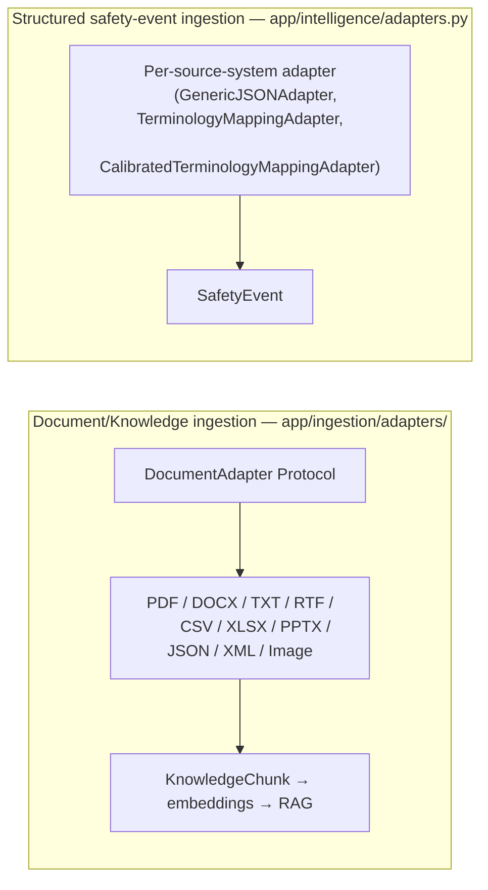

The document-ingestion adapters (`app/ingestion/adapters/`) already
include a **CSV adapter and an XLSX adapter** — confirmed by direct
inspection, not assumed. Both are explicitly, deliberately
"data-agnostic": `CSVAdapter`'s own docstring states it "does not guess
what *kind* of safety record a CSV represents (an incident register vs.
a training log vs. an inspection checklist) — that classification is a
future canonical-mapping layer's job." Today, a CSV/XLSX upload through
this pipeline becomes retrievable, citable text in the knowledge
corpus — genuinely useful (Mode B's documents/trackers can already be
searched and grounded against), but it does **not** become structured
`SafetyEvent` rows feeding the seven statistical lenses. That mapping
is exactly the "future canonical-mapping layer" the CSV adapter's own
docstring already anticipates, and it belongs to a future
implementation milestone (§17, Gap FG1; §18), not M31.

The structured-event adapters (`app/intelligence/adapters.py`) are a
different `Protocol` entirely — keyed by *source system* (e.g. which
external system sent this record and in what shape), not by *file
format*. `GenericJSONAdapter` is the default no-op; terminology-mapping
adapters layer canonicalization on top (M30 §3.3). This is the
extension point a Mode A integration (an external HSE platform, ERP,
etc.) already uses.

**Recommendation, reusing existing architecture rather than
duplicating it**: a future "structured-data-from-spreadsheet" capture
path (closing Gap FG1) should be built as a new module that runs
*ahead of* the existing structured-event adapters — parsing a CSV/XLSX
upload into `RawSafetyEventPayload` instances (reusing
`real_dataset_loader.py`'s own proven column-mapping approach as a
starting point, generalized beyond its current one-off dataset) — and
then hands off to the exact same
`SafetyEventIngestionService`/`EnterpriseIngestionService` path every
other structured source already uses. It must **not** duplicate
ingestion, versioning, deduplication, or provenance logic — those are
already correct and shared (M30 §3.1).

**Source identity, type, provenance, and quality**, per the existing
`DataSource` model (verified field-by-field): `name` (human label),
`source_type`, `status` (`active`/... — the only "trust" signal that
exists today; there is no numeric quality/reliability score anywhere on
this model, and none should be invented — §12), `system_identifier`
(the source's own self-identifier), `schema_version` (the source's
current payload-shape version), `config_metadata` (JSON, never
credentials), `api_client_id` (which credential is expected to
authenticate this source's submissions, `SET NULL` on credential
deletion). Ingestion timestamp and source-specific semantics are
recorded per-record on `SafetyEvent` itself (`ingestion_time`,
`source_system`, `source_record_id`, `source_value`,
`source_content_hash`), not duplicated onto `DataSource`. This model
already covers everything §8 of the milestone spec asks for except a
CSV/XLSX-to-structured-event mapping layer, which is Gap FG1, not a
`DataSource` shortcoming.

## 9. Observed vs. Deterministic vs. Predictive Intelligence

This section is the Field-Intelligence-Context-specific application of
M30 §9's Intelligence Object Model — restated narrowly for the four
composition categories (§7), not re-deriving the full object model.

| Category | Never represented as | Actually is |
|---|---|---|
| Observed fact | An interpretation | A governed, persisted record (`SafetyEvent`, `RiskAssessmentFinding`, `SafetyAction`) |
| Deterministic signal | A fact, a prediction, or a cause | A statistical computation over observed facts, reproducible from `calculation_versions` |
| Predictive signal | An observation, a certainty, or the "headline" of the context | A governed model's calibrated, abstention-capable output, one signal among several |
| Knowledge/evidence | A statement about the current site | Governed reference material a human should read against the current situation |

The one rule this document adds beyond restating M30 §9: **a Field
Intelligence Context response must never place a `PredictiveContext`
value in the same field/shape as a `deterministic_risk` value.** The
backend orchestrator already gets this right —
`compute_enterprise_intelligence()`'s own docstring states
`deterministic_risk` and `predictive_context` are "always two separate,
separately-labeled fields — never combined into one opaque number." Any
future Field Intelligence Context contract must preserve this exact
separation, never collapsing "risk" (M30 §3.10's three distinct
concepts) into one number for display convenience.

## 10. Temporal / As-Of Semantics

Extending M30 §15's `events_as_of()` discipline to context assembly,
with every temporal anchor named explicitly.

**Diagram D — Temporal model.**

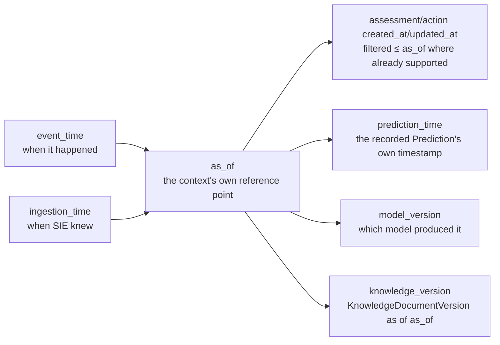

| Anchor | Existing mechanism | Context-assembly rule |
|---|---|---|
| `event_time` | `SafetyEvent.event_time` | Filtered via `events_as_of()`, unchanged |
| `ingestion_time` | `SafetyEvent.ingestion_time` | Filtered via `events_as_of()`, unchanged — the guard against using not-yet-knowable data |
| `as_of` | Already a first-class parameter on every intelligence/reporting/predict call | The context's single reference point; every category (§7) must be computed *as of the same value*, never a mix of "live now" and "as of X" across categories in one response |
| Assessment/action timestamps | `RiskAssessment.created_at`/`RiskAssessmentFinding` fields, `SafetyAction.created_at` | Point-in-time filtering already exists for actions in the M22A precedent (`created_at <= as_of`); a Field Intelligence Context must apply the equivalent filter to findings/assessments it includes, not merely "current status" |
| `prediction_time` | `Prediction.prediction_time` | The prediction's own generation timestamp — **must be shown alongside, never merged with, `as_of`** (a prediction generated last week and displayed in today's context is legitimately stale information the user must be able to see is stale) |
| `model_version` | `Prediction.model_version` | Always carried through; a context must never present a prediction without stating which model version produced it |
| `knowledge_version` | `KnowledgeDocumentVersion` (M30 §3.9's knowledge hierarchy) | RAG citations already carry a version label; a Field Intelligence Context reuses this unchanged — never re-fetches "current" document content without noting which version was cited |

**What happened vs. what was known — kept structurally distinct.**
`events_as_of()`'s two-part guard already is this distinction, encoded
as one filter. A Field Intelligence Context must never flatten it: an
event that occurred before `as_of` but was reported after it correctly
does not appear in a context computed *as of* that earlier point — this
is not a bug to route around, it is the entire point of "point-in-time
aware" (§5).

**One explicit staleness rule this document adds**: because a
`PredictiveContext` is the *latest already-recorded* prediction, not one
freshly computed for the requested `as_of`, a context assembled for an
`as_of` earlier than `prediction_time` must either omit the prediction
or clearly flag it as "generated after the point this context
describes" — never silently display a future-generated prediction as
if it were contemporaneous with an earlier `as_of`. This is the same
leakage discipline `events_as_of()` already enforces for events,
applied to the one intelligence category that does not (yet) have its
own `as_of`-parameterized recomputation.

## 11. Organizational Memory

Extending M30 §8, using this milestone's own five-way framing:

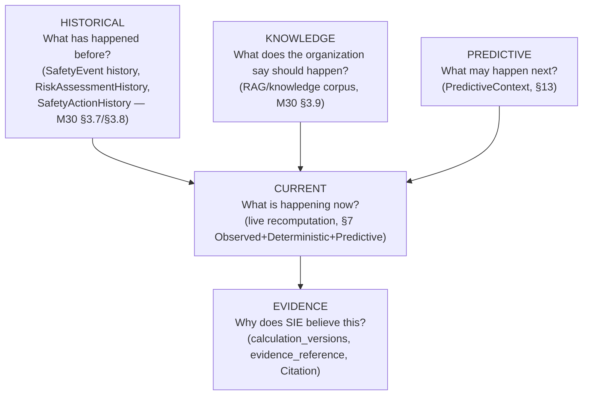

Organizational memory is not "a database of recent incidents" — it is
the union of governed historical fact (frozen-on-approval risk
assessments, append-only action/history tables), governed reference
material (the knowledge corpus), and the terminology/ontology layer
that makes any of it comparable across time (M30 §3.3). A Field
Intelligence Context's "Current" category is a read *over* this memory,
never a replacement for it, and never itself becomes memory — the
context is recomputed fresh on every request (§5, "derived"); nothing
about generating a context writes a new memory row. If a future
milestone wants to record "we showed this context to a human and they
made this decision," that decision is memory (already true today —
`RiskAssessmentHistory`/`SafetyActionHistory`/audit trails capture
exactly that), but the context object itself is not.

## 12. Evidence and Provenance

Reusing M30 §14's chain unchanged, restated for context assembly:

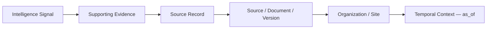

Every element the Field Intelligence Context surfaces must be traceable
through this chain using the mechanism its own category already has
(§7): `evidence_reference` for deterministic signals,
`feature_snapshot_id`/`model_id`/`model_version` for predictive signals,
`Citation`'s full chunk→document→source chain for knowledge, and the
existing `SafetyEvent`/`RiskAssessmentFinding` provenance fields for
observed facts. **No new, unified provenance object is introduced** —
M30 §14 already recommended against this, and nothing in this
investigation found a reason to reverse that recommendation; each
category's existing shape answers its own provenance question
correctly, and forcing them into one polymorphic record would make each
harder to query for no real gain.

**No invented confidence scores.** Per this milestone's own explicit
instruction: where the underlying methodology does not produce a
calibrated confidence value, the context must say so via explicit
limitations (data sufficiency, abstention reason, "insufficient
baseline periods") rather than fabricate a number. This is already the
system's own discipline (`INSUFFICIENT_DATA`, `NO_RELEVANT_EVIDENCE`,
abstention as a first-class `Prediction.outcome` value) — a Field
Intelligence Context inherits it unchanged, never adds a new
composite "overall confidence" on top of categories whose individual
confidence is not itself calibrated.

## 13. Predictive ML Boundary

**Corrected, precise finding** (this investigation went one level
deeper than M30's own gap analysis): the predictive-risk capability is
not merely "governed but unconnected" — the backend orchestrator
**already composes it into every site-scoped `GET /intelligence/enterprise`
response today.** `compute_enterprise_intelligence()`'s own
`_predictive_context()` helper queries for the latest `Prediction` row
matching the requested `organization_id`/`site_id` (`entity_type ==
"site"`) and, when one exists, returns it as `PredictiveContext` —
`prediction_id`, `prediction_time`, `outcome`, `risk_score`,
`probability`, `risk_category`, `model_version`. This function **never
triggers a new prediction and never retrains** — it only ever surfaces
an already-approved, already-deployed model's already-recorded output.
`deterministic_risk` and `predictive_context` are explicitly,
permanently kept as separate fields (M30 §9, §3.10).

The gap (M30 Gap G0) is therefore **entirely on the frontend
consumption side**, confirmed by direct inspection: `src/services/api/intelligence.ts`
has zero references to "predictive" anywhere in its TypeScript
interfaces, despite the backend response already carrying the field.
This materially changes the shape of any future implementation
milestone: closing this gap requires no backend change, no new
integration contract, and no risk to the existing governance gate — only
a frontend type addition and a presentational surface, both explicitly
out of scope for M31 itself (§18).

The full `Prediction` row (verified directly against
`app/models/prediction.py`) carries everything this milestone's own
required preservation list asks for:

| Required | `Prediction` field |
|---|---|
| Model identity | `model_id` (FK to `model_registry_entries`) |
| Model version | `model_version` |
| Prediction timestamp | `prediction_time` |
| `as_of` | Not a separate persisted field — `prediction_time` *is* the as-of value the prediction was generated for (`predict_as_of()`'s own parameter); a Field Intelligence Context must treat `prediction_time` as this value, never assume a separate field exists |
| Prediction horizon | `horizon_days` |
| Target definition | `entity_type`/`entity_id` (today, `"site"` only) + `outcome` vocabulary (governed, per `app/predictions/labels.py`) |
| Feature/model provenance | `feature_snapshot_id` (FK to `feature_snapshots`) |
| Limitations | `data_quality`, `abstention_reason` (when `outcome == NO_PREDICTION`), `explanation` (contributing-feature breakdown, never present for an abstained prediction) |
| Distinction between prediction and observation | Structural — `Prediction` is its own table, joined into the context only as `predictive_context`, never merged into `SafetyEvent` or `deterministic_risk` |

**Explicit constraints this document restates, not merely inherits**:
no new predictive model is built or trained in M31; the existing
methodology (a governed, calibration-validated linear model per M30
§3.10) is not modified; no deep learning or other ML algorithm is
introduced. The only thing this milestone changes about predictive risk
is *documenting precisely how a future Field Intelligence Context
consumes an output that already exists*, through the read path
(`compute_enterprise_intelligence()`) that already composes it.

**Diagram E — Intelligence technology layers.** Every category in §7
is produced by exactly one of these layers; no layer is ever skipped or
bypassed by a higher one (e.g. ML never writes directly to Data; RAG
never bypasses Governance's tenant/knowledge-scope rules):

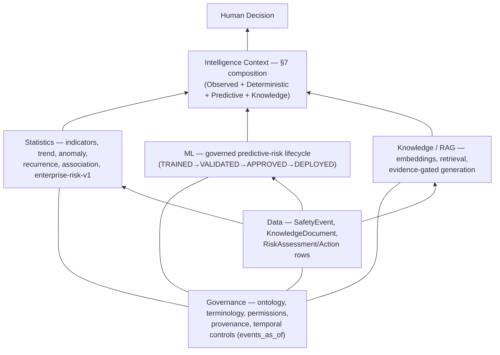

## 14. Human Decision Boundary

Restating M30 §13, applied specifically to the Field Intelligence
Context's own surface:

**A Field Intelligence Context MAY help a human understand:**
what is happening (observed facts), what is changing (deterministic
trend/indicators), what appears unusual (anomalies), what patterns
exist (recurrence), what risk signals exist (deterministic +
predictive, clearly separated), what evidence supports those signals
(§12), and what knowledge is relevant (RAG).

**A Field Intelligence Context MUST NOT, ever, as a side effect of being
generated or displayed:**

- Create a mandatory intervention
- Close a finding or an action
- Change a risk rating
- Approve a risk assessment
- Modify any source record (event, finding, control, action, knowledge
  document)
- Issue a permit
- Assign operational responsibility
- Make any safety-critical decision on a human's behalf

Architecturally, this is enforced the same way M30 §13 already verified
it is enforced elsewhere: **a Field Intelligence Context is a read-only
composition.** Its assembly logic, wherever it is eventually
implemented, must call only the existing read paths this document
names in §7/§9/§13 — `compute_enterprise_intelligence()`,
`events_as_of()`, `RetrievalService.search()`, direct
`RiskAssessmentFinding`/`SafetyAction` reads — and no mutation path.
This is a structural constraint a future implementation milestone
should enforce the same way `TenantScopedRepository` structurally
prevents a cross-tenant query (M30 §3.11): by never importing a write
service into the context-assembly module at all, not merely by
convention.

## 15. Operational Workflow Boundary

Restating M30 §17's loop-vs-workflow distinction, using this
milestone's own framing.

**Diagram F — SIE vs HSE workflow boundary.**

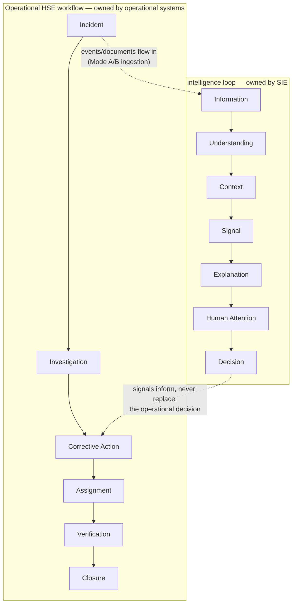

SIE may consume information from the operational workflow (an incident
report becomes a `SafetyEvent`; a corrective action *within SIE's own
Risk-Assessment-originated Actions domain* is tracked, M30 §3.8) and
may eventually observe its outcomes (M30 §10, still a named
architectural gap, not built here or in M30). It does not need to, and
per §2/§3 must not, own the *entire* operational workflow shown on the
left — investigation, assignment-within-a-third-party-system, and
formal closure of an operationally-owned incident remain outside SIE
wherever a mature operational system already owns them (Mode A). Only
where an organization has no such system (Mode B) does SIE's own
lightweight Actions domain fill part of that role — and even then, only
the "decide → act → track" slice M30 §3.8 already scopes it to, never
the full six-stage workflow shown above.

## 16. Current Repository Capabilities

Assessed directly against the repository at the M31 baseline, using
this milestone's own four-way classification. Cross-references to M30
sections are given rather than re-derived.

**Already implemented:**
- Events: capture, provenance, temporal filtering (M30 §3.1–§3.2, §3.4)
- Deterministic intelligence: indicators, trend, anomaly, recurrence,
  association, `enterprise-risk-v1` (M30 §3.5)
- Predictive risk: full governed lifecycle, **and already composed into
  the enterprise-intelligence read path** (§13, correcting M30's own
  framing)
- Risk assessments, findings, controls, control effectiveness (M30
  §3.7)
- Actions, action history (M30 §3.8)
- Knowledge, ontology, embeddings, retrieval, evidence-grounded RAG
  (M30 §3.3, §3.9)
- Ingestion (two systems, correctly kept apart) and `DataSource`
  registration (M30 §3.1, §8 above)
- Ontology governance, terminology calibration (M30 §3.3)
- Provenance mechanisms, per-domain (M30 §14, §12 above)
- Temporal/as-of handling via `events_as_of()` (M30 §3.4, §15)
- Permissions, defense-in-depth tenant isolation (M30 §3.11)
- Authentication (human + machine, `RequestContext`) (M30 §3.11)

**Partially implemented:**
- Document/spreadsheet ingestion exists (CSV/XLSX adapters, §8) but
  only feeds the knowledge corpus, not structured `SafetyEvent` rows,
  for an arbitrary organization (Gap FG1)
- Predictive risk is composed into the backend response but has no
  frontend surface (§13 — a smaller gap than M30 originally framed it)
- Evidence/provenance exists per-domain but with no single "explain any
  object" surface (M30 §16, Gap G6)
- Organizational memory accumulates correctly but has no
  Intervention→Outcome→Learning feedback path (M30 §10, Gap G9 —
  unchanged by M31, out of scope here)

**Architectural gap** (named, not filled, by this milestone):
- No Field Intelligence Context composition contract or endpoint exists
  yet — this document is that contract; §18 proposes where it gets
  built
- No general CSV/XLSX-to-structured-event capture path (Gap FG1)
- No operational-context entities (work activity, workforce,
  contractor, equipment, permits — M30 §16, Gap G5, unchanged)
- `observation_topic` ontology layer has no `SafetyEvent` storage
  location (M30 §16, Gap G2, unchanged — directly blocks a richer
  Field Intelligence Context "hazard topic" dimension)

**Future milestone** (§18).

## 17. Current Gaps

New gaps this investigation identified, specific to Field Intelligence
Context composition (in addition to the still-open M30 gaps referenced
above, which are not restated in full here):

- **FG1 (P1)** — No general, production, API-reachable path from a
  Mode-B spreadsheet/CSV upload to structured `SafetyEvent` rows. The
  document-ingestion CSV/XLSX adapters exist and correctly feed the
  knowledge corpus; the one existing structured-event mapping
  (`real_dataset_loader.py`) is a one-off script, not a registered
  capability. This is the most concrete, near-term piece of unfinished
  architecture the Mode B story needs (§8, §18).
- **FG2 (P1)** — No Field Intelligence Context composition contract or
  read model exists. This document is the architecture for one; no
  code implements it yet.
- **FG3 (P2)** — `PredictiveContext.prediction_time` staleness relative
  to a context's own `as_of` has no existing display/flagging
  convention (§10's new staleness rule is a recommendation, not yet
  implemented anywhere).
- All P0/P1/P2 gaps named in M30 §16 remain open and unchanged by this
  milestone; none are restated here to avoid duplication.

## 18. Future Implementation Milestones

Consistent with M30 §17's own sequencing logic (connect before you
build), and explicitly not started here:

**Next — Field Intelligence Context Composition v0.1.** Build the
read-only composition contract this document defines: one service
function assembling §7's four categories for a given
`organization_id`/`site_id`/`as_of`/`window_days`, reusing
`compute_enterprise_intelligence()`, `events_as_of()`, direct
Risk-Assessment/Actions reads, and `RetrievalService` unchanged; one
thin API route exposing it, permission-gated identically to the
existing intelligence routes. Should not build any new statistical
computation — every number must come from an existing function call.

**Then — Lightweight Capture Extension v0.1.** Close Gap FG1: a
registered, general CSV/XLSX-to-`RawSafetyEventPayload` mapping module,
handed off to the existing `SafetyEventIngestionService`/
`EnterpriseIngestionService` path unchanged. Should not build a new
ingestion pipeline, versioning scheme, or provenance mechanism — only a
new *front door* onto the ones that already exist.

**Then — Operational Context Foundation** (as M30 §17's own M32 already
proposed): begin closing Gap G5/G2, informed by which real data source
an actual deploying organization can provide first (M30 §19, Open
Question 2) — unchanged recommendation, not restated in full.

**Later — Intervention & Outcome Intelligence, Embedded AI Layer,
Continuous Safety Intelligence**: unchanged from M30 §17's own M33-M35
proposals; this document does not revise them, since nothing in this
investigation's findings changes their reasoning.

**Diagram G — Long-term learning loop.** Restated from M30 §4/§10, with
this milestone's own status markers. **M31 closes none of this loop —
it only defines the composition contract (§7) for the "Intelligence"
box.** Nodes marked ✅ exist and are reused unchanged; nodes marked ⛔
are named architectural gaps, not built by M30 or M31:

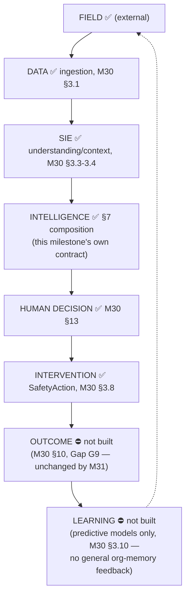

## 19. Frontend Implications

No frontend code is implemented in M31, per the milestone's own
instruction. This section documents intent, not code, and confirms it
against the one existing precedent already doing something adjacent:
`HomePage.tsx`'s composition of three independent backend surfaces into
one "what needs your attention" page (M30 §3.12) is architecturally the
closest thing SIE has today to a Field Intelligence Context view — the
future implementation should generalize that existing pattern (one
`AsyncState` per category, no fixture fallback, honest empty states),
not invent a new one.

The intended feel, restated from the milestone's own instruction: **"What
does SIE understand about this site right now?"** — never "AI Command
Center." A future workspace should present the four §7 categories
clearly separated (never a single blended feed), each in the
restrained, evidence-first visual language `docs/FRONTEND_ARCHITECTURE.md`
already establishes (navy/teal, no AI-brain iconography, no glow, no
confidence-meter dial — M30 §3.12 confirmed zero chat/AI-assistant UI
exists anywhere in the new frontend today, and this document recommends
that remain true here too). Predictive signals, once surfaced (§13),
must visually and textually read as a governed model's output —
carrying `model_version` and `prediction_time` visibly, per §10 — never
as an "AI recommendation."

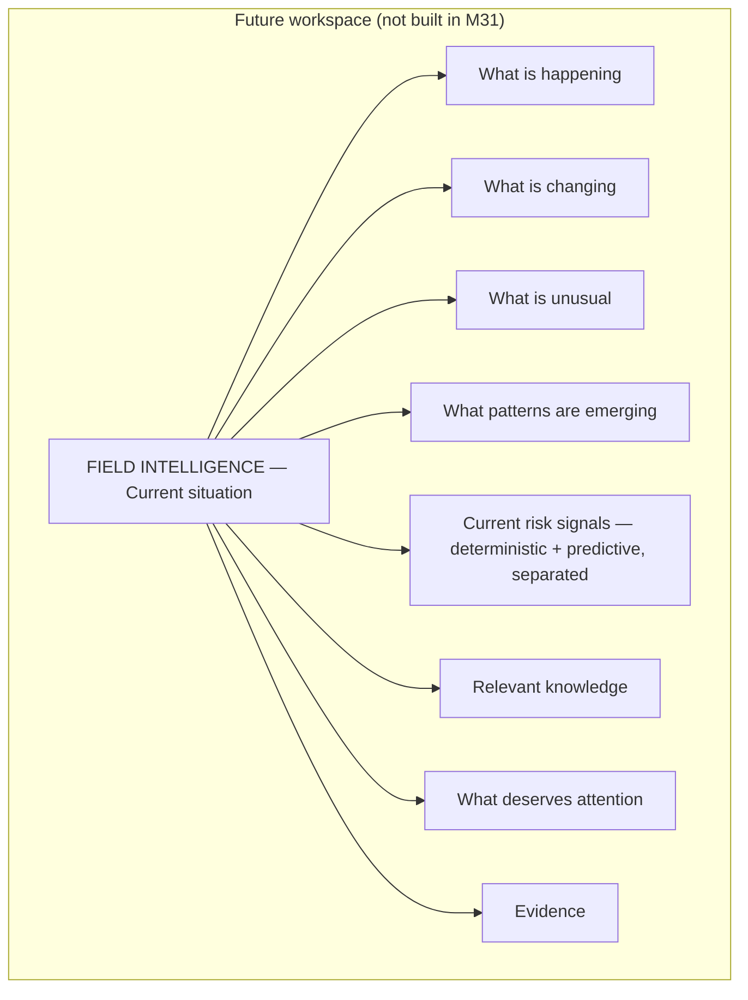

## 20. Security / Tenant Implications

No new authorization surface is introduced. A future Field Intelligence
Context composition must inherit, unmodified, the exact defense-in-depth
pattern M30 §3.11 already verified: schema-level `organization_id`
(`OrganizationScopedMixin`), query-level tenant filtering
(`TenantScopedRepository`'s "no get-by-id-alone" guarantee), and
authorization-level context pinning (`RequestContext`/
`authorize_context()`, never trusting a request-supplied
`organization_id` override). Because the context *composes* multiple
existing read calls rather than issuing new queries, the compositional
risk worth naming explicitly: **every one of the four category calls
(§7) must be independently passed the same authorized
`organization_id`/`site_id`, never a value threaded loosely through a
shared context object that a bug could leave stale or unscoped between
calls.** This is a implementation-time discipline to require of the
eventual composition service (§18), not a new mechanism to design —
the existing per-call authorization is already sufficient if each call
is actually made correctly.

Knowledge/RAG composition (§7, §12) must continue to respect the
existing GLOBAL-vs-ORGANIZATION scoping (M30 §3.9) unchanged — a
context assembled for one organization must never surface another
organization's private knowledge documents, exactly as `RetrievalService`
already guarantees today.

## 21. Performance / Scalability Considerations

Consistent with M30 §16 (Gap G7, explicitly P2, an accepted v0.1
tradeoff) and §6's own recommendation against a persisted state table:
a Field Intelligence Context, composed of four independently-recomputed
categories, will cost roughly the sum of its parts — one
`compute_enterprise_intelligence()` call (already a bounded, small
number of queries per M30 §3.5), the existing findings/actions reads,
and one retrieval call. This document makes no new performance claim
and proposes no new caching mechanism — consistent with M30's own
explicit instruction not to solve a performance problem that has not
yet been measured. If a future implementation milestone finds the
composed call too slow in practice, the correct fix (per M30 §6) is a
cache keyed on `(organization_id, site_id, as_of, window_days)`,
invalidated on write to any composed domain — never a redesign into a
mutable, eagerly-maintained table.

## 22. Explicit Non-Goals

Restated verbatim from the milestone's own instruction, all confirmed
honored by this document (no code implementing any of the following was
written):

New HSE modules; new incident management; new inspection management;
new permit management; new contractor management; new training
management; new CMMS functionality; autonomous agents; autonomous
intervention; new ML algorithms; deep-learning implementation; LLM
implementation; IoT streaming implementation; outcome-learning
implementation; automatic risk reassessment; automatic action creation;
automatic finding closure; a full Field State operational database;
replacing existing HSE platforms.

---

## Consistency check

Reread against the two governing principles before finalizing:

> **SIE should understand the field, not manage the field.** Every
> composition described in §7 is read-only; §14 states the mutation
> boundary explicitly and structurally, not merely as a convention.
>
> **SIE should inform operational HSE systems and decision-makers, not
> replace them.** §3/§15 name exactly which workflows stay outside SIE
> and why; §4/§8 treat Excel/CSV/documents/forms as legitimate capture
> inputs precisely because they are *inputs to intelligence*, never
> because they let SIE start managing the operational process those
> files came from. §17/§18 name the one concrete gap (Gap FG1) that
> would make Mode B more complete, scoped narrowly to capture, not to
> any new management workflow.

Both hold throughout this document as written.
